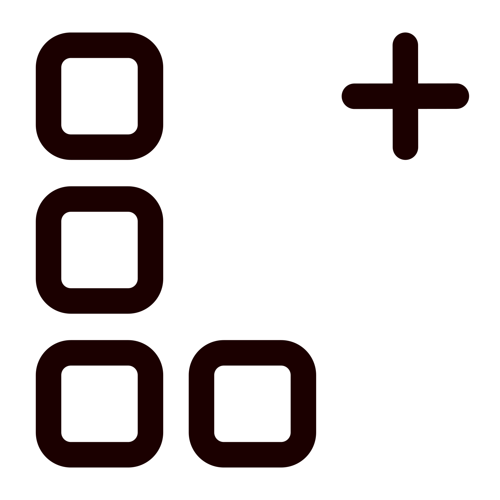

<a name="readme-top"></a>

[![Issues][issues-shield]][issues-url]
[![MIT License][license-shield]][license-url]
[![LinkedIn][linkedin-shield]][linkedin-url]

<!-- PROJECT LOGO -->
<br />
<div align="center">
  <a href="https://github.com/7Cedars/loyal-customer-engagement-v2"> 
    
  </a>

<h3 align="center">Loyal: Web3 Customer Engagement that Works </h3>

  <p align="center">
    A composable solidity protocol and lightweight dApp for real-world customer engagement. 
    <br />
    <br />
    <!--NB: TO DO --> 
    <a href="../README.md">Conceptual Overview</a> ·
    <a href="/nextjs/vendor-app/">Vendor dApp</a> ·
    <a href="/nextjs/customer-app/">Customer dApp</a> ·
    <a href="https://clpv.vercel.app">Deploy a Loyalty Program</a>
  </p>
</div>


<!-- TABLE OF CONTENTS -->
<details>
  <summary>Table of Contents</summary>

- [About](#about)
  - [Built With](#built-with)
- [Directory Structure](#directory-structure)
- [Getting Started](#getting-started)
  - [Prerequisites](#prerequisites)
  - [Quickstart](#quickstart)
- [Usage](#usage)
  - [Test](#test)
  - [Test coverage](#test-coverage)
  - [Build](#build)
  - [Deploy](#deploy)
  - [Live example](#live-example)
- [Known Issues](#known-issues)
- [Contributing](#contributing)
- [License](#license)
- [Contact](#contact)
- [Acknowledgments](#acknowledgments)
  
</details>

<!-- ABOUT  -->
## About
The Loyal protocol provides a modular, composable and gas efficient framework for blockchain based customer engagement programs. 

### Built With
- Solidity v0.8.19
- Foundry v0.2.0
- OpenZeppelin v5.0.2
- eth-infinitism's account-abstraction v0.7.0
- Pimlico 

- It builds on the following ERC standards:  
  - [ERC-20 & ERC-721: Fungible and Non-Fungible Token standard]: the Loyalty Program contract mints fungible points; Gift contracts mint non-fungible loyalty Cards. 
  - [ERC-4337: Account Abstraction]: Loyalty Cards are abstracted accounts. 
  - [EIP-712: Typed structured data hashing and signing]: customer requests are executed through signed messages (transferred in front-end app as Qr codes) to the vendor. It allows the vendor to cover all gas costs. 
  - [ERC-165: Standard Interface Detection]: gift contracts are checked if they follow they ILoyaltyGift interface.  

For a previous version that builds on ERC-1155 (multi-token standard) and ERC-6551 (token based accounts) see [here](https://github.com/7Cedars/loyalty-program-contracts).


## Directory Structure
```
foundry

│
├── lib                               # Foundry libraries
│   ├── account-abstraction           # eth-infinitism account abstraction library
│   │   └── ...                       
│   ├── forge-std                     # forge contracts library 
│   │   └── ...
│   ├── openzeppelin-contracts        # OpenZeppelin contracts library
│   │   └── ...
│   └── ...
│
├── script                            # Foundry libraries
│   ├── DeployFactoryPrograms.s.sol   # Deploy script of loyalty program factory
│   ├── DeployLoyaltyGifts.s.sol      # Deploy script for example gift contracts
│   ├── HelperConfig.s.sol            # Helper config 
│   └── SendPackedUser.s.sol          # Script to create packed user operations. 
|
├── src                               # Smart contract source code
│   ├── interfaces                    # Contracts interfaces
│   │   ├── ILoyaltyCard.sol          # Loyalty card interface
│   │   ├── ILoyaltyGift.sol          # Loyalty gift interface
│   │   └── ILoyaltyProgram.sol       # Loyalty program interface
│   ├── sample-gifts                  # Example gift contracts
│   │   ├── giftsMetadata             # Metadata for loyalty gifts 
│   │   │     └──...                   
│   │   ├── FreeCoffee.sol            # Example of points for gift exchange
│   │   ├── FreeCupCake.sol           # Example of points for gift exchange
│   │   ├── FridayFifteen.sol         # Example of time constrained exchange
│   │   └── GoldToken.sol             # Example of tiered access 
│   ├── FactoryCards.sol              # Factory contract to create loyalty cards.
│   ├── FactoryPrograms.sol           # Factory contract to create loyalty programs.
│   ├── LoyaltyCard.sol               # Bespoke ERC-4337 loyalty card contract.
│   ├── LoyaltyGift.sol               # ERC-721 base gift contract.
│   ├── LoyaltyProgram.sol            # ERC-20 loyalty program contract.
│   └── ...
│
├── test              # Foundry tests
│   ├── fuzz          # Fuzz tests.
│   │     └── ...
│   ├── invariant     # Invariant tests (tbi).
│   │     └── ...
│   └── unit          # Unit tests.
│         └── ...
│
├── .env.example      # Example .env file 
├── Makefile          # Deployment scripts
├── foundry.toml      # Foundry configuration file
└── README.md         # Foundry project README
```

<!-- GETTING STARTED -->
## Getting Started

To get a local copy up and running do the following.

### Prerequisites
<!-- NB ! Need docker to run!  -->
Foundry
  - Install following the directions at [getfoundry.sh](https://getfoundry.sh/).
  - You'll know you did it right if you can run `forge --version` and you see a response like `forge 0.2.0 (816e00b 2023-03-16T00:05:26.396218Z)`

### Quickstart
1. Clone the repo
    ```
    git clone https://github.com/7Cedars/loyalty-program-contracts.git
    ```
2. navigate to the folder
    ```
    cd loyalty-program-contracts
    ```
3. create a .env file and add the following:
     ```
     SELECTED_RPC_URL = <PATH_TO_RPC> 
     ```
   
  Where <PATH_TO_RPC> is the url to your rpc provider, for example: https://eth-sepolia.g.alchemy.com/v2/... or http://localhost:8545 for a local anvil chain. 

  Note that tests will not run on a chain that does not have an ERC-6551 registry deployed. Due to compiler conflicts, it is not possible to deterministically deploy the erc6511 registry inside the test suite itself.    

4. run make
    ```
    make
    ```

## Usage
### Test 
  ```sh
  $ forge test
   ```

### Test coverage
  ```sh
  forge coverage
  ```

and for coverage based testing: 
  ```sh
  forge coverage --report debug
  ```

### Build
  ```sh
   $ forge build
   ```

### Deploy
  ```sh
   $ forge script --fork-url <RPC_URL> script/DeployLoyaltyProgram.s.sol --broadcast
   ```
Where <RPC_URL> is the url to your rpc provider, for example: https://eth-sepolia.g.alchemy.com/v2/...  


<!-- USAGE EXAMPLES -->
### Live example
A front-end dApp demonstration of this web3 protocol has been deployed on vercel.com. 
Try it out at [https://loyalty-program-psi.vercel.app/](https://loyalty-program-psi.vercel.app/). 


<!-- KNOWN ISSUES -->
## Known Issues
This contract has not been audited. Do not deploy on anything else than a test chain. More specifically:
- Testing coverage is still low. Fuzz tests especially are still underdeveloped.
- The function `_validateTarget` at LoyaltyCard.sol is likely still insecure. 
- ... 

See the [open issues](https://github.com/7Cedars/loyalty-program-contracts/issues) for a full list of proposed features (and known issues).

<!-- CONTRIBUTING -->
## Contributing
Contributions and suggestions are more than welcome. If you have a suggestion that would make this better, please fork the repo and create a pull request. You can also simply open an issue with the tag "enhancement". Thank you! 

1. Fork the Project
2. Create your Feature Branch (`git checkout -b feature/AmazingFeature`)
3. Commit your Changes (`git commit -m 'Add some AmazingFeature'`)
4. Push to the Branch (`git push origin feature/AmazingFeature`)
5. Open a Pull Request

<!-- LICENSE -->
## License

Distributed under the MIT License. See `LICENSE.txt` for more information.


<!-- CONTACT -->
## Contact

Seven Cedars - [@7__Cedars](https://twitter.com/7__Cedars) - cedars7@proton.me

GitHub profile [https://github.com/7Cedars](https://github.com/7Cedars)


<!-- ACKNOWLEDGMENTS -->
## Acknowledgments
- This project was build while following [PatrickCollins](https://www.youtube.com/watch?v=wUjYK5gwNZs&t) amazing Learn Solidity, Blockchain Development, & Smart Contracts Youtube course. 
- ... 

[issues-shield]: https://img.shields.io/github/issues/7Cedars/loyalty-program-contracts.svg?style=for-the-badge
[issues-url]: https://github.com/7Cedars/loyalty-program-contracts/issues/
[license-shield]: https://img.shields.io/github/license/7Cedars/loyalty-program-contracts.svg?style=for-the-badge
[license-url]: https://github.com/7Cedars/loyalty-program-contracts/LICENSE.txt
[linkedin-shield]: https://img.shields.io/badge/-LinkedIn-black.svg?style=for-the-badge&logo=linkedin&colorB=555
[linkedin-url]: https://linkedin.com/in/linkedin_username
[product-screenshot]: images/screenshot.png
<!-- See list of icons here: https://hendrasob.github.io/badges/ -->
[Next.js]: https://img.shields.io/badge/next.js-000000?style=for-the-badge&logo=nextdotjs&logoColor=white
[Next-url]: https://nextjs.org/
[React.js]: https://img.shields.io/badge/React-20232A?style=for-the-badge&logo=react&logoColor=61DAFB
[React-url]: https://reactjs.org/
[Tailwind-css]: https://img.shields.io/badge/Tailwind_CSS-38B2AC?style=for-the-badge&logo=tailwind-css&logoColor=white
[Tailwind-url]: https://tailwindcss.com/
[Vue.js]: https://img.shields.io/badge/Vue.js-35495E?style=for-the-badge&logo=vuedotjs&logoColor=4FC08D
[Redux]: https://img.shields.io/badge/Redux-593D88?style=for-the-badge&logo=redux&logoColor=white
[Redux-url]: https://redux.js.org/
